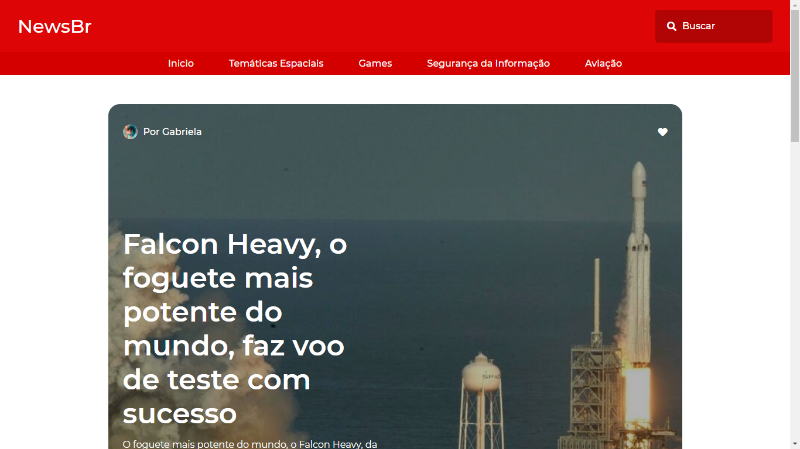

  
  
  
  
  
  

<h3 align="center">Portal de noticias com EJS</h3>
<!--<h4 align="center"><a href="https://portal-de-noticas-000.herokuapp.com/">Ver projeto</a></h4>-->

Um portal de noticias com sistema de autenticação, gerenciamento de posts, usuários e categorias usando o mongodb atlas.
   

<h3>Informações gerais</h3>

### Introdução
Esse projeto se trata de um blog desenvolvido usando NodeJs e MongoDb. O blog tem os posts, posts mais visualizados, visualização individual de posts, sistema de busca por posts, busca por categorias, paginação, sistema de autenticação, cadastro de posts usando o Tiny, cadastro de categorias e usuários, contando também com suporte a adição de imagens.

Segue um vídeo demonstrativo

-------

### Configuração obrigatória do projeto
A fim de evitar que minhas estatisticas do github fiquem "bufadas" com código javascript de Terceiros, neste novo repositório, removi a pasta 'public/tinymce' do repositório, agora a pasta 'tinymce' se encontra dentro do arquivo 'tinymce.zip' na raiz do projeto, desta forma, estraia-o arquivo ZIP dentro do diretório 'public/'

### Como rodar o projeto?
1. Você precisa de ter o nodejs instalado na sua máquina.
2. Na pasta Raiz, rode o comando npm install. Esse comando vai instalar todas as dependências
3. Crie um arquivo na pasta raiz chamado ".env"
4. Esse arquivo ".env" deve ter as mesmas chaves do arquivo “.env.example”, porém, você deverá preencher os dados com uma conexão do mongodb. (Já sabe como o mongoDB funciona? Se sim pode pular a parte abaixo)

### Como criar uma conexão no Mongodb Atlas
Você pode seguir esse tutorial [https://github.com/gabrielogregorio/MongodbAtlas](https://github.com/gabrielogregorio/MongodbAtlas)

----------------------

### Inicindo o projeto
Bom, essa é a etapa mais simples de todas!
1. No arquivo index.js, descomente a rota "app.get('/magica', (req, res) =>"
2. inicie a aplicação. Na pasta raiz rode o comando "node index.js"
3. Agora com a aplicação rodando e uma mensagem "conectado ao banco de dados" aparecendo no seu console, você só precisa acessar esse endereço:

[http://127.0.0.1:8080/magica](http://127.0.0.1:8080/magica)

Sim, mágica, está tudo pronto!

Para acessar o painel administrativo basta acessar esse endereço:

[http://127.0.0.1:8080/login](http://127.0.0.1:8080/login)

As credenciais de acesso são:

| Credencial | Valor |
|------------|-------|
| Login      | root  |
| Senha      | root  |

E é isso! Eae, alguma dica ou sugestão?
